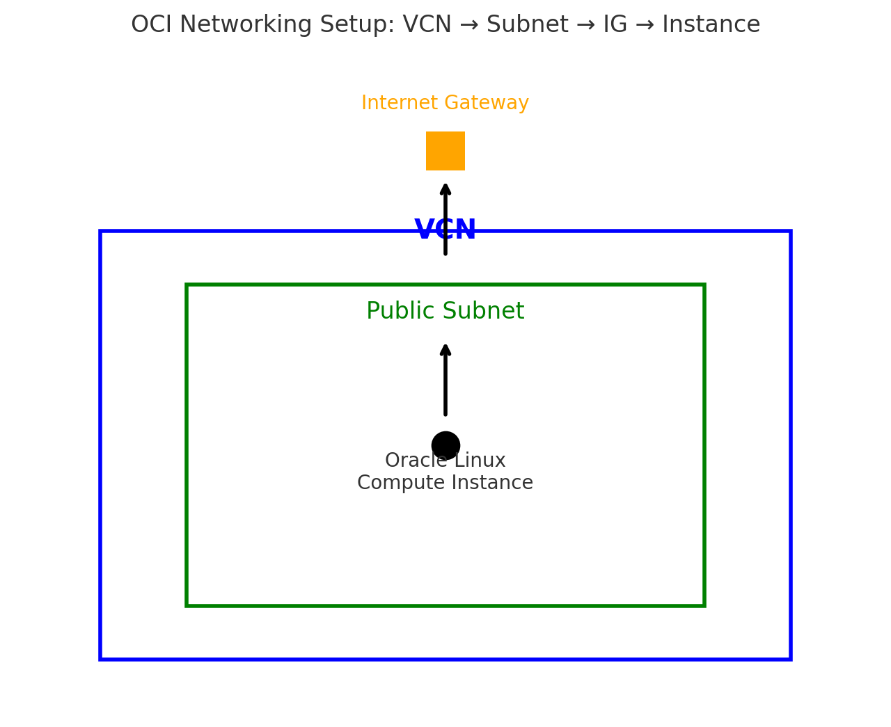

# oci-compute-lab# 🚀 Oracle Cloud Infrastructure (OCI) – Compute Instance Deployment

## 📌 Project Overview
This project demonstrates how to set up a secure and fully functional **Oracle Linux 9.6 compute instance** in Oracle Cloud Infrastructure (OCI).  
The goal was to build foundational skills in **cloud networking, security, and remote system administration**.

---

## 🛠️ What I Built
- ✅ **Virtual Cloud Network (VCN)** with public subnet, internet gateway, and route table.  
- ✅ **Security rules** to allow SSH access securely.  
- ✅ **SSH key pair** generation and authentication.  
- ✅ **Oracle Linux 9.6 instance** deployed in the cloud.  
- ✅ **Remote SSH connection** from local machine to the instance.  
- ✅ **System update/patching** (kernel + core services).  

---

## 🎯 Skills Demonstrated
- ☁️ Cloud Networking (VCN, subnets, gateways, security lists)  
- 🔐 Secure Remote Access with SSH keys  
- 💻 Linux System Administration (Oracle Linux)  
- ⚙️ Cloud Infrastructure Provisioning  

---

## 🔎 Steps to Reproduce
1. **Create a Virtual Cloud Network (VCN)**  
   - Public subnet  
   - Internet gateway  
   - Security list rule for port 22 (SSH)  

2. **Generate SSH Keys**  
   ```bash
   ssh-keygen -t rsa -b 4096

